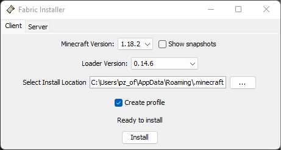
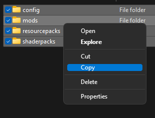
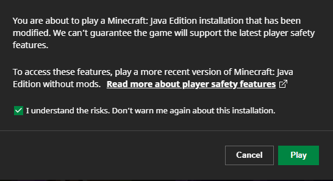
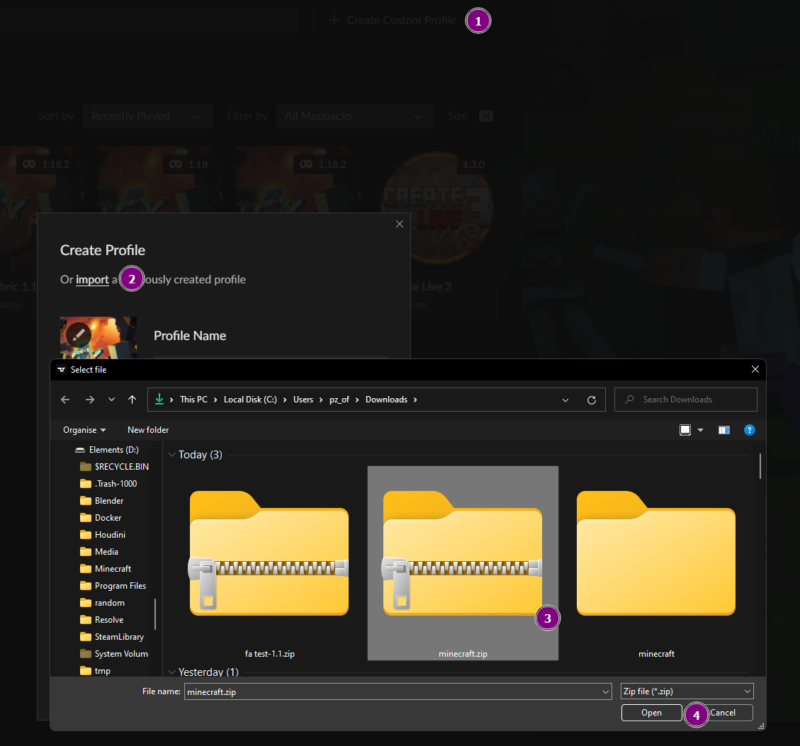
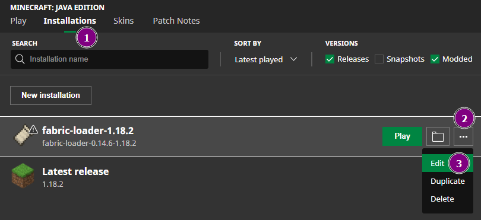
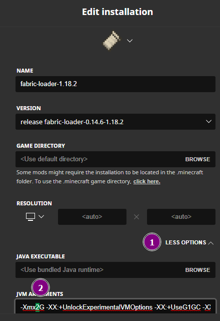

# Installation Guide for the official Launcher
1 Download Fabric from [fabricmc.net](images/https://fabricmc.net/use/installer/)

2 Open the file from step 1, sellect `1.18.2` and Loader Version `0.14.6`

3 Press `install`

4 Press Windows+R, paste `%appData%\.minecraft` and press enter

5 Download the `modpack-official-launcher.zip` from above and open it in an **new** explorer Window

6 Open `modpack-official-launcher.zip` and copy the files

7 Paste the files into the explorer opened in step 4

8 Open the launcher and start the game, make sure to have fabric sellected

(8.1 add the checkmark and press play if you see this message)

9 In case of low FPS, lag spikes and the game not working follow the Troubleshooting 

# Installation Guide for the Curseforge Launcher
Download `curseforge.zip` from above and open it in with 
([Curseforge App download link](images/https://download.curseforge.com/#download-options), you might wanna disable Start with System for Curseforge and Overwolf)

# Troubleshooting
## Game Starts without mods
Can you see this symbol in the mod folder? 

    I see a blank file symbol > install java

    I see a different symbol > Right-CLick > Open with... > Checkmark allways open with > sellect java (the file wont run but this should open java when the game is started)

## Low FPS or Lag even with low render distances
Go into the launcher, and follow the steps bellow 

change the sellected number to a higher one, this is the RAM which the Game is allowed to use, too big numbers aren't good either, try 5 at first and save the edits

## Get Voice Chat working
Go to the keybind settings and search for `chat`, change `Voice Chat GUI` to an valid keybind, we will use F7 for this example

Open the GUI and sellect settings, for only hearing players just `sellect the speaker`
To speak yourself do the same with the microphone, you may want to change the `Activation Type` from `Push to Talk` to `Voice`

Sellect `Enable Microphone testing` and change the slider above till you can haer yourself but not other sounds from the background

## Get started with utility mods
Press `M` to open the map, with right click you can add Waypoint and share the location

Add a keybind for `Open Chesttracker GUI` ( eg. `F8`) and open it
if you had chest opend it will show you the content of all chest in the world, clicking on an item will show you it's location

In case you haven't opend the graphic settings till now, they are "a bit" different, you can still use shaders in the top right, or you press `k` inagame to toggle shaders

Btw have you looked at the included resource packs?